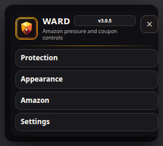
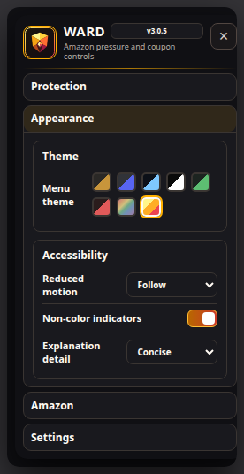
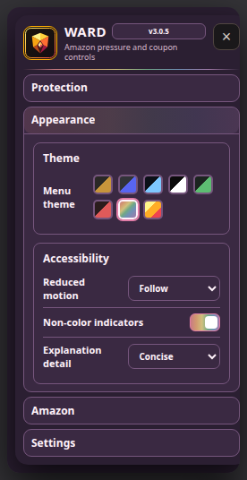
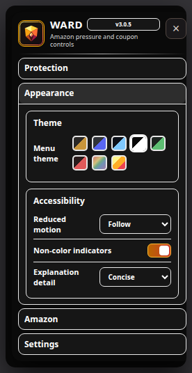
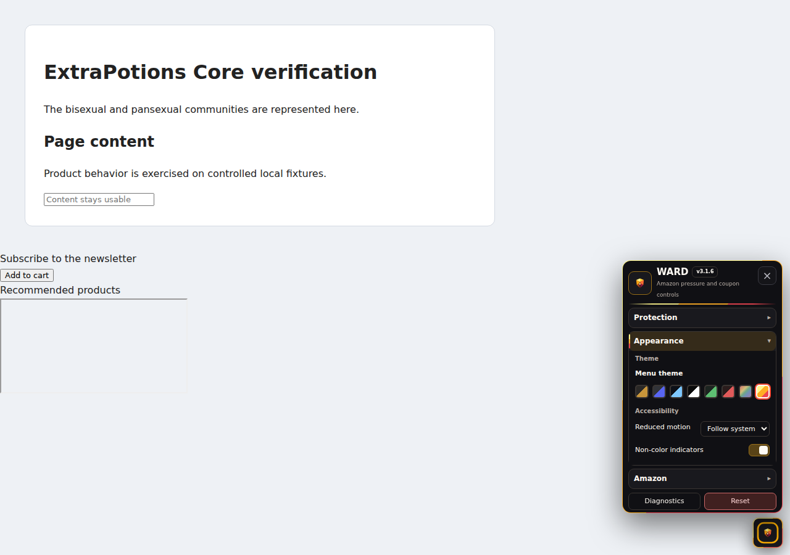

  

<h1 align="center">WARD</h1>

<strong>Retail Pressure Protection</strong>

  A privacy-first shopping companion for reducing supported retail pressure, upsells, urgency, sponsorships, and promotional distractions.

  
  
  
  
  
  

## Install

  
  
  

## What WARD Does

- Identifies supported Amazon pressure, upsell, urgency, sponsorship, and recommendation patterns.
- Applies reversible Allow, Dim, Collapse, Hide, Annotate, and Temporary Reveal actions.
- Protects essential purchasing controls by downgrading unsafe structural actions.
- Can auto-clip eligible coupons with visible status, quarantine, and recovery controls.
- Explains intervention decisions without collecting page text, form values, selectors, URLs, or markup.
- Provides Essential, Balanced, and Custom protection with adapter health and activity diagnostics.

### Amazon ad coverage

Complete sponsored search results, Amazon display-ad placements, sponsored product-detail carousels, and sponsored Rufus questions are hidden under the default Balanced policy. Ad disclosures are hidden with their placement. Product details, purchasing controls, reviews, and ordinary recommendations remain available; mixed purchasing content retains the essential-information safeguards. Custom actions, disabled categories, temporary reveal, and restoration still apply.

### Choose Hide or Dim

Open **Protection → Content action** and choose **Hide** or **Dim** for all protected content. The choice applies immediately, is remembered across reloads, and takes precedence over recommendation cleanup and the protection-level defaults. **Automatic** restores the selected protection level's behavior. Hide falls back to Dim for unsupported or structurally unsafe content; essential purchasing information remains visible. Disabled categories and patterns stay disabled. In Custom mode, Default action applies when Content action is Automatic.

## Screenshots

<table>
  <tr><th width="20%">Overview</th><th width="20%">WARD</th><th width="20%">Pride</th><th width="20%">High contrast</th><th width="20%">Fixture</th></tr>
  <tr><td align="center"></td><td align="center"></td><td align="center"></td><td align="center"></td><td align="center"></td></tr>
</table>

## Diagnostics and product compatibility

Use **Show Diagnostics** / **Hide Diagnostics**, then **Copy Diagnostics** when troubleshooting. Reports include **Page**, **Technical**, **Console**, and **Plugin** sections, identify active ExtraPotions products and visible conflicts on the current page, and are never uploaded automatically.

## License

**Code:** [PolyForm Noncommercial License 1.0.0](LICENSE-CODE.md) 
**Artwork and documentation:** [CC BY-NC-SA 4.0](LICENSE-ASSETS.md)

See [NOTICE.md](NOTICE.md) for the split-license notice.

## Disclaimer

WARD is an independent project and is not affiliated with or endorsed by Amazon.
