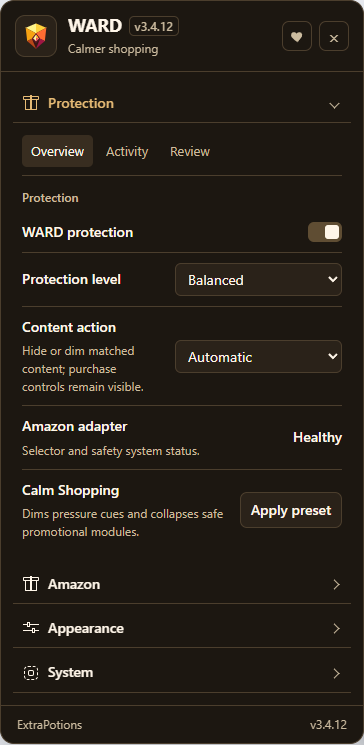
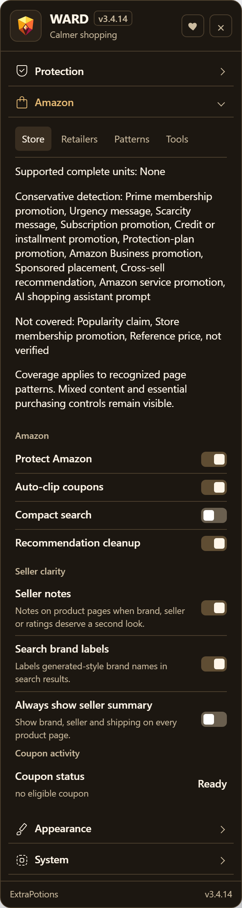

# WARD

**Less shopping pressure, more room to decide**

Reduce supported Amazon promotions and distractions while keeping essential product and purchasing information available.

## What you can do

- **Protection choices:** Essential, Balanced, and Custom let you choose the level of cleanup.
- **Hide or dim:** choose a content action, or let the protection level decide.
- **Supported Amazon clutter:** reduce sponsored placements, membership upsells, urgency messages, and selected recommendations.
- **Reversible changes:** reveal affected content temporarily or restore it when needed.
- **Coupon options:** optionally clip eligible coupons with visible status and recovery controls.
- **Keep the essentials:** safeguards preserve important purchasing information.

## See it in action

Screenshots show the current product with sample content.

<table>
  <tr>
    <td width="50%" valign="top" align="center"> <strong>Protection levels and content actions</strong></td>
    <td width="50%" valign="top" align="center"> <strong>Amazon categories and coupon options</strong></td>
  </tr>
</table>

## Get started

1. Install a userscript manager such as [Violentmonkey](https://violentmonkey.github.io/get-it/) or [Tampermonkey](https://www.tampermonkey.net/).
2. [Install WARD](https://github.com/ExtraPotions/WARD/raw/refs/heads/main/ward.user.js) and confirm in your userscript manager.
3. Refresh Amazon and open the product launcher.

Open Protection to choose a level and Content action. Use Amazon to select the categories you want handled. Unsupported or mixed content may remain visible to preserve essential information.

## Support

[Support development](https://ko-fi.com/expdare). Donations are optional. All features remain available without donating.

## License

**Code:** [PolyForm Noncommercial License 1.0.0](LICENSE-CODE.md) 
**Artwork and documentation:** [CC BY-NC-SA 4.0](LICENSE-ASSETS.md)

## About

WARD is an independent project and is not affiliated with or endorsed by Amazon.
